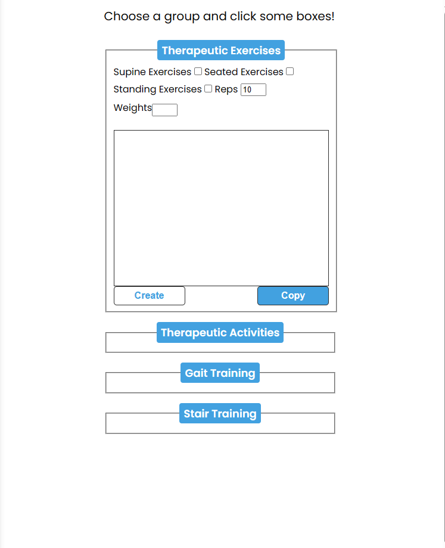

# Quick Rehab Notes

## A quick way to generate common documentation for physical therapy notes

This simple web application generates common intervention statements with just a few mouse clicks:

- Four common billable units are available; ther ex, ther act, neuro re-ed, and gait training
- Click one of the four selections and select any of the options that populate
- Click 'Create' followed by 'Copy' to then paste into your own or facility electronic health record system

## Watch this video for a demo!

If you are unsure how to use this application, this video demo should answer your questions

## How to tweak this project for your own uses

Since this is targeted towards physical therapists working in skilled nursing facility rehab, I'd encourage you to clone and rename this project to use for your own puposes. It's a good starter boilerplate.

## Note: This project is not intended to be visually appealing

This project is intended to be simple and easy to follow to allow the user to quickly access what they need and generate
their text to add to their documentation. This project is not HTML/CSS heavy but it works and will improve your documentation productivity
